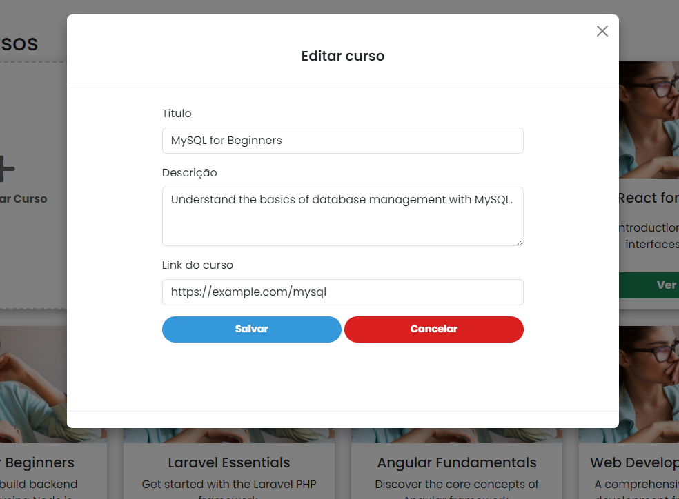
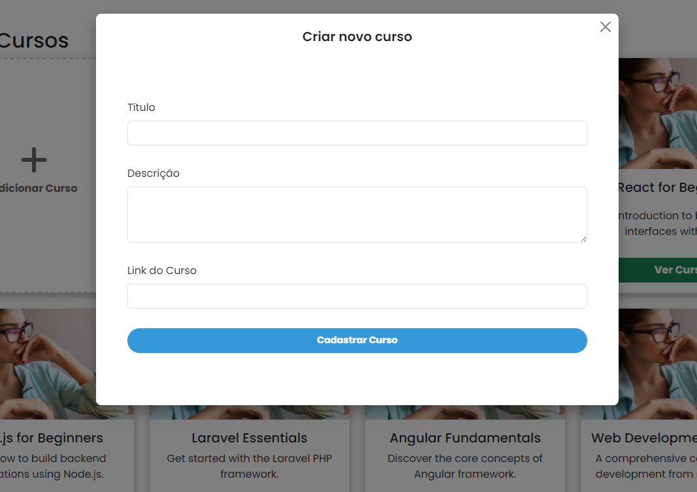

# CRUD de Cursos - Desafio Revvo 

## Front End e API em PHP

<p align="center">


<br>

<p align="center">
  <a href="#sobre">Sobre</a> •
 <a href="#funcionalidades">Funcionalidades</a> •
 <a href="#como-executar">Como executar</a>
</p>


<br>

## Sobre

<p align="center">

</p>

Este projeto foi desenvolvido em PHP puro para fornecer uma aplicação CRUD (Create, Read, Update, Delete) de cursos, integrando frontend e backend sem o uso de frameworks. O sistema inclui uma interface responsiva e leve com Bootstrap e jQuery para manipular o conteúdo de cursos e uma API RESTful para realizar operações no banco de dados.  

Foi desenvolvido no **Windows** utilizando **XAMPP** (Apache e phpMyAdmin/MySQL) e o **PHP 8.3**.  

---

## Arquitetura

Utilizei uma arquitetura simples, focando em separar o front do back end, e organizar cada parte do projeto em seu devido lugar.

Na pasta `/api`, temos:

- `/config`, que contém o arquivo `db.php`, o qual configura a conexão com o banco de dados;
- `/controllers`, que contém o arquivo `CourseController.php`, o único controller porque o único modelo é o dos Cursos;
- `/models`, que contém o arquivo `Course.php`, a definição de modelo da tabela dos cursos, e integra as requisições com o banco de dados, enquanto também limpa os dados enviados nos corpos das requisições antes de inserí-las no banco;
- `/tests`, que contém o arquivo `ValidateRequests.php`, um conjunto de testes unitários feito em PHP puro;
- `index.php`, o arquivo com as definições das rotas e a API.

Já na pasta `/view`, temos:
- `/assets`, que contém o arquivo de estilos css, dois scripts de jquery, e as imagens utilizadas no projeto;
- `index.php`, a real view do projeto, que integra tudo em si.

## **Atenção! Os testes e a documentação do postman foram escritos pressupondo que o projeto esteja nesse caminho: `C:/xampp/htdocs/revvo-test`, por isso, a url dos testes é `localhost/revvo-test/api/index.php`! Caso desejem testar as requisições do postman e os testes unitários, por favor alterem o nome da pasta raíz para `revvo-test`!**

## Funcionalidades

<p align="center">


</p>


</p>

- Cadastro, edição, exclusão e listagem de cursos com integração completa entre frontend e backend
- Carrossel responsivo com banners dinâmicos
- Modal para visualizar, editar e excluir cursos
- Modal para criação de novos cursos
- Modal que aparece na primeira visita do usuário ao site
- Campo de pesquisa dinâmica para filtrar cursos pelo título
- Interface responsiva para desktops, notebooks, tablets e smartphones

---

## Como executar

Para rodar o projeto localmente, você precisará de um ambiente com **XAMPP** configurado com o PHP 8.3 e MySQL. Os passos abaixo assumem que você já instalou e configurou o XAMPP:

### Configuração do banco de dados

1. Abra o phpMyAdmin no navegador e crie um banco de dados chamado `bd_revvo`.
2. Importe o arquivo `bd_revvo.sql` que está na raiz do projeto para criar as tabelas e registros necessários para o funcionamento do sistema.

### Configuração do projeto

1. Clone o repositório para o diretório `htdocs` do XAMPP:

    ```bash
    # Clone o repositório
    $ git clone https://vitor-tx-admin@bitbucket.org/vitor-tx/desafio_revvo.git

    # Entre na pasta do projeto
    $ cd desafio_revvo
    ```

2. No navegador, acesse o projeto:

    ```shell
    http://localhost/desafio_revvo/view/index.php 
    # ou http://localhost/revvo_test/view/index.php caso tenham mudado o nome da pasta!
    ```

3. Certifique-se de que o servidor Apache e o MySQL estão em execução no XAMPP.

### Testes com POSTMAN

Foi desenvolvido um conjunto de testes unitários em PHP puro, localizados no arquivo `tests/ValidateRequests.php`. Para rodar ele, basta estar na mesma pasta e inserir `php ValidateRequests.php` no terminal. 

Para realizar testes manuais na API, utilize o [Postman](https://www.postman.com/) com as rotas disponíveis:

- `GET /api/index.php?id={id}` - Obter detalhes de um curso específico
- `GET /api/index.php` - Listar todos os cursos
- `POST /api/index.php` - Cadastrar um novo curso
- `PUT /api/index.php` - Editar um curso existente
- `DELETE /api/index.php` - Excluir um curso
- Há uma pequena documentação feita com o postman no arquivo `postman_docs`. Você pode subir ele no seu postman para analisar exemplos de requests:


---

## Tecnologias utilizadas

- PHP 8.3
- MySQL
- jQuery
- Bootstrap
- XAMPP (Apache, phpMyAdmin)
- Postman (para testes)

---

## Sobre o Desenvolvedor

**Vitor Manoel Gonçalves Teixeira**  
Desenvolvedor Full Stack com experiência sólida em React, Next.js, Angular, JQuery, Bootstrap, Python, Django, PHP, Laravel, JavaScript, TypeScript, Node.js, Dart, Flutter, React Native, entre outras tecnologias.  

- **Whatsapp**: (38) 99826-5400  
- **Email**: vitor.teixeira267@gmail.com  
- **Github**: [Vitor-Tx](https://github.com/Vitor-Tx)
- **LinkedIn**: [Vitor Teixeira](https://www.linkedin.com/in/vitor-teixeira-eof/)

---
